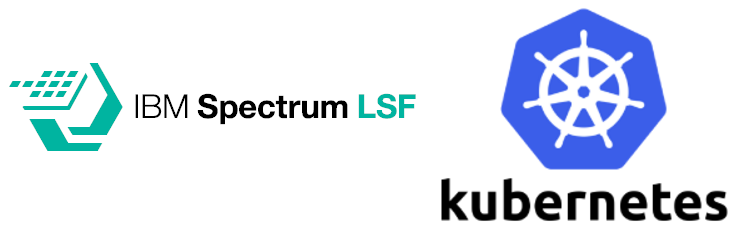
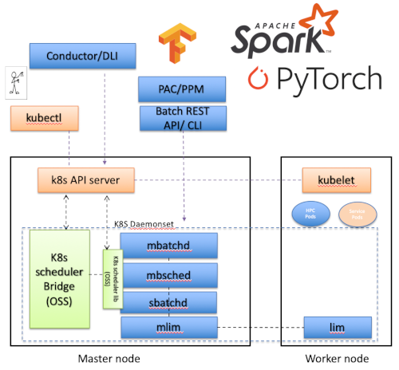

# lsf-kubernetes

Advanced scheduling for Kubernetes

## Features
- Advanced GPU scheduling policies like NVlink affinity.
- Pod co-scheduling
- Fairshare
- Reservation / backfill (avoid job starvation)
- Sophisticated limit policies
- Queue prioritization
- Scalability / throughput
- Resource ownership policies
- License management
- Integration with LSF add-ons: RTM, Application Center, Process Manager

## Architecture

## Articles and Blogs

- [Bridging HPC and Cloud Native Development with Kubernetes](https://www.hpcwire.com/solution_content/ibm/cross-industry/bridging-hpc-and-cloud-native-development-with-kubernetes/), Khalid Ahmed, 2019-Apr-16, HPCWire

## Download

To download the tech preview, visit the [IBM website](https://epwt-www.mybluemix.net/software/support/trial/cst/programwebsite.wss?siteId=548&tabId=1091&w=1).

Support is available on the IBM Cloud Tech public slack.  The channel name is `#icplsf-tp-support`.  To get an invite to the workspace, [click here](http://ibm.biz/BdsHmN).

## Deployment options

### LSF as a scheduler for ICP/Kubernetes

A tech preview is available for ICP users. The preview is available until July 1, 2019. For more information about the integration, refer to the [Quick Start Guide](https://github.com/IBMSpectrumComputing/lsf-kubernetes/blob/master/doc/IBM_Spectrum_Computing_Cloud_Pak_Quickstart_Guide.pdf).

### Kubernetes add-on for LSF

A tech preview is available for LSF customers. The preview is available until Nov 30, 2019. For more information about the integration, refer to the [README](https://github.com/IBMSpectrumComputing/lsf-kubernetes/blob/master/doc/README_LSF.md).
